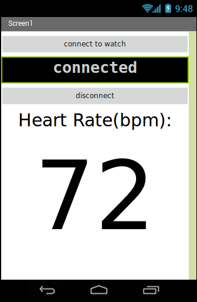

# ME772
code repository for course project of mechatronics

## Main components used:

* HC05 bluetooth module
* Lithium Polymer battery 7.4V
* 128x64 OLED screen
* Arduino pro mini
* Breadboard, wires, etc.
* heart rate monitor
## The circuit:

## The App:
The app was built using MIT App inventor 2:  
The screen looks like this:  

these are the components used for making the app:  

this is the block diagram of the control of the app:  

